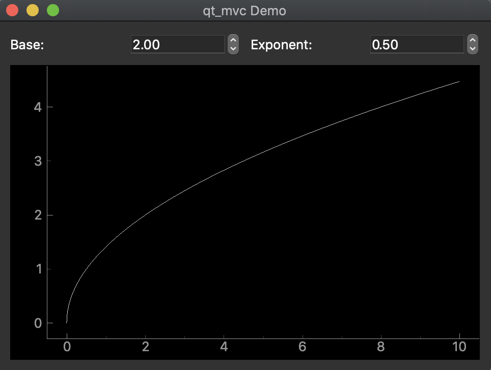

Qt Briefcase
============

This is a test of using `Briefcase`_ (part of `The BeeWare Project`_)
to package a PySide2/qtgraph scientific app.

This mostly worked "out of the box" by following `The BeeWare Tutorial`_.
What follows are instructions based on the tutorial
for building this MacOS .app yourself from a clone of this repository.

This was tested with Python 3.7. It may work for other Python versions.
It is suggested that your virtual environment use Python 3.7 just in case.

1. Set up a virtualenv and activate it
(you may get this to work from a conda env,
but these instructions are sticking as close as possible
to the BeeWare tutorial). In the top-level qtbriefcase directory:

.. code-block:: bash

   python3 -m venv beeware-venv
   source beeware-venv/bin/activate

Add beeware-venv to your .gitignore
to avoid committing it to your own repo.

2. Install BeeWare (I suggest the `python -m pip install`_ method).

.. code-block:: bash

   python -m pip install --pre beeware

3. You can skip the tutorial's 'briefcase new' step,
since this repo was also constructed via that step.

If you are starting a new app project,
initialize the project with 'briefcase new' first,
then add your code to that project's structure.

4. Install dependencies into the virtualenv:

.. code-block:: bash

   python -m pip install pyside2==5.13.0
   python -m pip install pyqtgraph==0.11.0rc0  # numpy should be installed with it

Note that the dependencies are already added to pyproject.toml.
For your own projects, make sure your dependencies are specified there.

.. code-block:: toml

   requires = [
       'pyside2==5.13.0',
       'pyqtgraph>=0.11.0rc0',
       'numpy'
   ]

5. Navigate to the inner qtbriefcase folder
and run the app in developer mode to make sure it executes:

.. code-block:: bash

   cd qtbriefcase
   briefcase dev

6. If the app ran successfully in step 5, create the application scaffold:

.. code-block:: bash

   briefcase create

7. Build the application:

.. code-block:: bash

   briefcase build

8. Run the application:

.. code-block:: bash

   briefcase run

9. If it successfully ran, build the installer:

.. code-block:: bash

   briefcase package --no-sign

There should now be an installer for your app
in the qtbriefcase/qtbriefcase/macOS folder.
You can test installation of the app on your system.
(Uninstalling this demo app only requires deleting the "Qt Briefcase.app" file
from your Applications folder).

.. _`Briefcase`: https://github.com/beeware/briefcase
.. _`The BeeWare Project`: https://beeware.org/
.. _`The BeeWare Tutorial`: https://docs.beeware.org/en/latest/tutorial/tutorial-0.html
.. _`python -m pip install`: https://snarky.ca/why-you-should-use-python-m-pip/